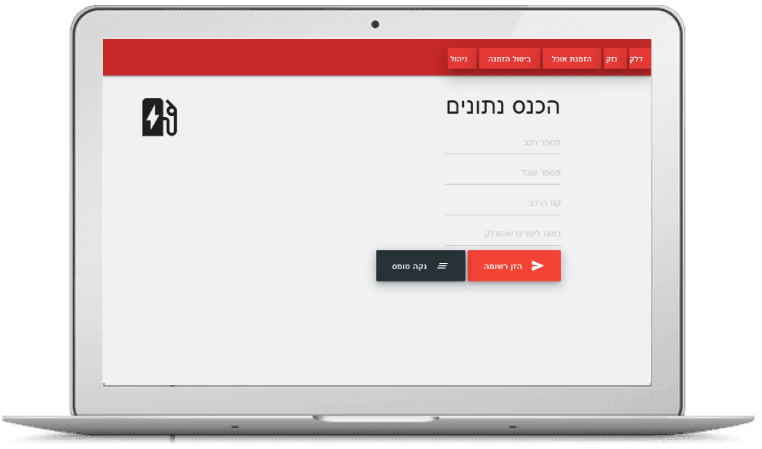

# AvisApp
Avis Israel documentation system.

"Avis App" website, Created for AVIS Israel with the purpose of optimizing and documenting day to day operations like fuel & fleet management, employee lunch orders & more.
It is an offline-capable, installable PWA with a fully-featured administration panel.
The Backend is built with PHP and features a MySQL database & Automatic email sending capabilities.
The Frontend is built with HTML, CSS & JS and uses the Materialize framework for UI design.

